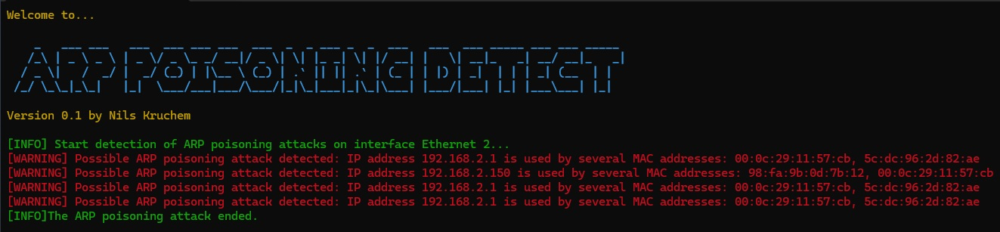

ARP-POISONING-DETECT version 0.1 by Nils Kruchem for python 3

Small Python program for detecting ARP poisoning / ARP spoofing attacks in a network by analyzing ARP data packets for duplicate IP assignments to a physical address.

Usage: python3 (or python) arp_poisoning_detect_01.py
The script will automatically start sniffing and analyzing ARP packages in the network.
Please note that this is a first experimental version.

ARP-POISONING-DETECT automatically selects the network adapter according to a prioritization algorithm. Non-virtual, wired adapters are preferred. If this does not work, feel free to specify the network adapter manually by changing the code.
The script only works correctly if the computer on which it is running is connected to the SPAN / mirroring port of the switch and this has been configured accordingly.

The script was tested only in a small test environment with 12 IP addresses and a managed layer 2 D-Link switch on the operating systems Windows 10 x64, Windows 11 x64 and Kali Linux 2024.1.
Please let me know how it works in larger environments.

The functionality of the script can best be tested with arpspoof, ettercap, or bettercap in Kali Linux.

Dependencies on Python libraries that need to be additionally installed via the pip install command:
netifaces (may require Microsoft Visual C++ 14.0 or higher, available with the Microsoft C++ Build Tools)
psutil
scapy
termcolor

Usage on your own risk.
No liability is accepted for damages.
Particular caution is required in productive OT environments with sensitive bus systems.
